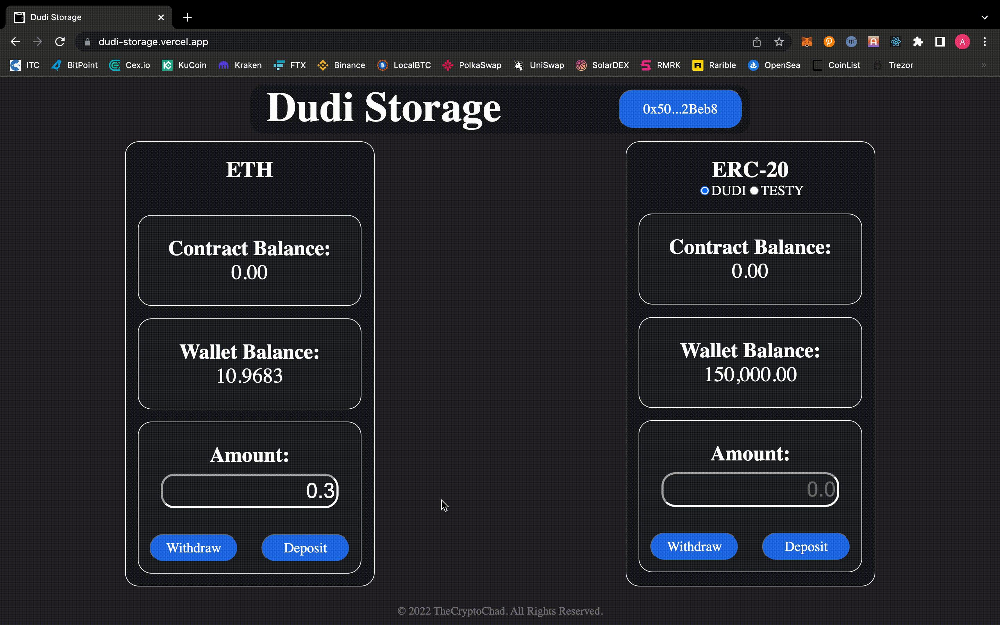
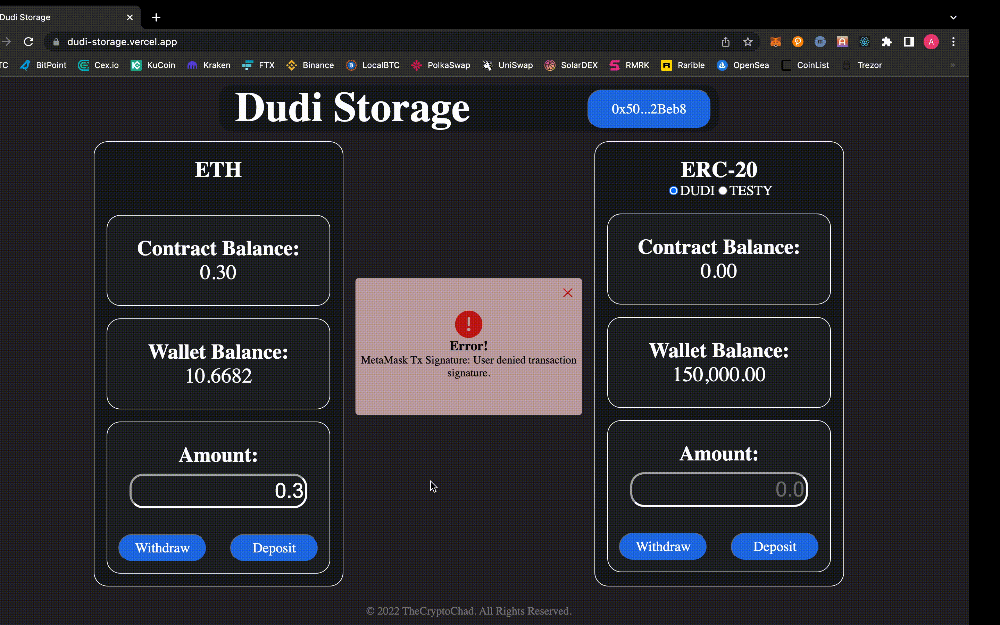

# Dudi Storage

This project is a frontend that can interact with a smart contract that allows the user to store tokens, and has a minimum balance required to allow withdrawals. The contracts are deployed on Ethereum's Ropsten Test Network. Only the contract owner can withdraw from it, so don't deposit tokens unless you're willing to loose them.  The site was built using NextJS and Web3JS, and styled with ChakraUI and Framer-Motion. The smart contracts were built with Solidity and deployed:
- [DUDI Token](https://ropsten.etherscan.io/token/0x983ff1730e32bb8b59e24f77A392E6E5dC7831C7)
- [TESTY Token](https://ropsten.etherscan.io/token/0x1c50474a84D984dF2482842E15b44E7E905A204D)
- [DudiStorage](https://ropsten.etherscan.io/address/0xcCA044b3D2aE86F91FE738b39Ce75bdB241C1bB2)

## Prerequisite

- Node.js
- npm or yarn

## Demo

A fully usable version of the app is hosted [here](https://dudi-storage.vercel.app).

## Installation

In order to run this app locally you must first clone the repository with:
```sh
git clone https://github.com/TheCryptoChad/DudiStorage.git
```

Then, navigate inside the directory and install the necessary dependencies with:
```sh
npm install
```

Finally, you can run the app with:
```sh
npm start
```

## Features

- ### Connecting Wallets

The app allows for the use to connect their MetaMask wallet to interact with the smart contract. For the sake of simplicity, the contract will interact with the first account in the wallet. The app will indicate a successful connection via the `Connect Wallet` button displaying the connected wallet address.


- ### Tokens & Balances

The app will display ETH and ERC-20 balances on both the contract and the connected wallet, which will update everytime an action is performed. The user is also able to choose between both ERC-20 tokens for the purpose of interacting with the contract.


- ### Deposits

The user can choose to deposit ETH or an ERC-20 token into the contract via the app. This deposit has no minimum amount.


- ### Withdrawals

The user can choose to withdraw ETH or an ERC-20 token from the contract via the app. This withdrawal will only proceed if there is a minimum of 0.5 ETH or 10 of the respective ERC-20 token. Remember that only the contract creator can withdraw tokens from it.


- ### Success/Error Messages

Whenever a deposit or withdrawal is successful, a modal will emerge confirming it. In a similar manner, if there is any error during the interaction, an error modal will display what went wrong.



